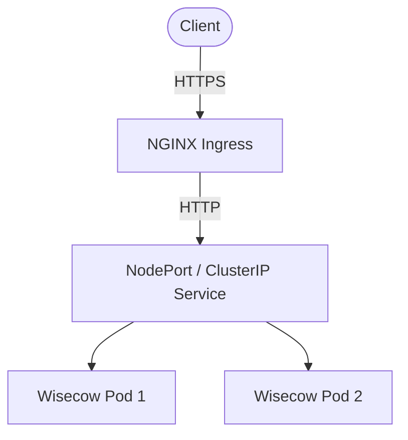

# Wisecow Application - DevOps Project

We will build this project step by step from scratch like a beginner-friendly real DevOps project.

You already know some AWS and Linux basics, so this project will help you combine everything together.

## Why this project is professional
If you include a detailed README, an Architecture diagram, Screenshots, Clean YAML, and Proper GitHub Actions, your project stands out and looks highly professional. We have included all of these here!

## 🏗️ Architecture Diagram


## 📸 Application Screenshot


## Full Project Roadmap

We will build this in stages:

| Step | What You Learn |
|------|----------------|
| 1 | Setup Linux machine |
| 2 | Install Docker |
| 3 | Run Wisecow app locally |
| 4 | Create Dockerfile |
| 5 | Build Docker image |
| 6 | Push image to DockerHub |
| 7 | Install Kubernetes |
| 8 | Create Deployment |
| 9 | Create Service |
| 10 | Create Ingress |
| 11 | Enable HTTPS/TLS |
| 12 | Setup GitHub Actions CI/CD |
| 13 | Create README & Architecture |

---

## PHASE 1 — Environment Setup

### Step 1 — Create Ubuntu Server
You can use:
* AWS EC2 Ubuntu OR Local Ubuntu VM

**Recommended:**
* Ubuntu 22.04
* t2.medium (Because Kubernetes needs more RAM.)

### Step 2 — Connect to Server
Use SSH:
```bash
ssh -i key.pem ubuntu@your-public-ip
```

### Step 3 — Update System
```bash
sudo apt update && sudo apt upgrade -y
```

---

## PHASE 2 — Install Docker

### Step 4 — Install Docker
Run one by one:
```bash
sudo apt install docker.io -y
```

Start docker:
```bash
sudo systemctl start docker
```

Enable docker:
```bash
sudo systemctl enable docker
```

Check:
```bash
docker --version
```

### Step 5 — Give Docker Permission
```bash
sudo usermod -aG docker $USER
```
Then logout and reconnect SSH.

Check:
```bash
docker ps
```
If no `sudo` required → correct.

---

## PHASE 3 — Setup Wisecow Application

### Step 6 — Clone Repository
```bash
git clone https://github.com/nyrahul/wisecow.git
```
Go inside:
```bash
cd wisecow
```
See files:
```bash
ls
```
You will see: `wisecow.sh`

### Step 7 — Understand Application
Open file:
```bash
cat wisecow.sh
```
You will see `fortune`, `cowsay`, `nc` (netcat). This script creates funny cow messages.

### Step 8 — Install Dependencies Locally
```bash
sudo apt install fortune-mod cowsay netcat-openbsd -y
```

### Step 9 — Run Application Locally
Give permission:
```bash
chmod +x wisecow.sh
```
Run:
```bash
./wisecow.sh
```

Open another terminal:
```bash
curl localhost:4499
```
You should see cow output.

---

## PHASE 4 — Dockerization

### Step 10 — Create Dockerfile
Create file: `nano Dockerfile`
Paste:
```dockerfile
FROM ubuntu:22.04

RUN apt update && \
    apt install -y fortune-mod cowsay netcat-openbsd

ENV PATH="$PATH:/usr/games"

WORKDIR /app

COPY wisecow.sh .

RUN chmod +x wisecow.sh

EXPOSE 4499

CMD ["./wisecow.sh"]
```

### Step 11 — Create .dockerignore
Create file: `nano .dockerignore`
Add:
```text
.git
README.md
```

### Step 12 — Build Docker Image
```bash
docker build -t wisecow:v1 .
```
Check:
```bash
docker images
```

### Step 13 — Run Docker Container
```bash
docker run -d -p 4499:4499 wisecow:v1
```
Check running container:
```bash
docker ps
```
Test:
```bash
curl localhost:4499
```
**SUCCESS** 🎉

---

## PHASE 5 — Push Image to DockerHub

### Step 14 — Create DockerHub Account
Go to Docker Hub and create an account.

### Step 15 — Login DockerHub
```bash
docker login
```
Enter username and password/token.

### Step 16 — Tag Image
Example:
```bash
docker tag wisecow:v1 arunjadhav16/wisecow:v1
```

### Step 17 — Push Image
```bash
docker push arunjadhav16/wisecow:v1
```
Now the image is stored online.

---

## PHASE 6 — Kubernetes Setup

### Step 18 — Install Minikube
Install kubectl:
```bash
sudo snap install kubectl --classic
```
Install Minikube:
```bash
curl -LO https://storage.googleapis.com/minikube/releases/latest/minikube-linux-amd64
sudo install minikube-linux-amd64 /usr/local/bin/minikube
```

### Step 19 — Start Kubernetes Cluster
```bash
minikube start --driver=docker
```
Check:
```bash
kubectl get nodes
```

---

## PHASE 7 — Kubernetes Deployment

### Step 20 — Create Kubernetes Folder
```bash
mkdir kubernetes
cd kubernetes
```

### Step 21 — Create deployment.yaml
Create file: `nano deployment.yaml`
Paste:
```yaml
apiVersion: apps/v1
kind: Deployment
metadata:
  name: wisecow
spec:
  replicas: 2
  selector:
    matchLabels:
      app: wisecow
  template:
    metadata:
      labels:
        app: wisecow
    spec:
      containers:
      - name: wisecow
        image: arunjadhav16/wisecow:v1
        ports:
        - containerPort: 4499
```

### Step 22 — Apply Deployment
```bash
kubectl apply -f deployment.yaml
```
Check:
```bash
kubectl get pods
```

### Step 23 — Create service.yaml
Create file: `nano service.yaml`
Paste:
```yaml
apiVersion: v1
kind: Service
metadata:
  name: wisecow-service
spec:
  selector:
    app: wisecow
  ports:
    - protocol: TCP
      port: 80
      targetPort: 4499
  type: NodePort
```
Apply:
```bash
kubectl apply -f service.yaml
```

### Step 24 — Access Application
```bash
minikube service wisecow-service
```
Browser opens automatically 🎉

---

## PHASE 8 — Ingress

### Step 25 — Enable Ingress
```bash
minikube addons enable ingress
```

### Step 26 — Create TLS Certificate
```bash
openssl req -x509 -nodes -days 365 -newkey rsa:2048 \
-keyout tls.key \
-out tls.crt \
-subj "/CN=wisecow.local/O=wisecow"
```

### Step 27 — Create TLS Secret
```bash
kubectl create secret tls wisecow-tls \
--cert=tls.crt \
--key=tls.key \
-n wisecow
```

### Step 28 — Create ingress.yaml
Create file: `nano ingress.yaml`
Paste:
```yaml
apiVersion: networking.k8s.io/v1
kind: Ingress
metadata:
  name: wisecow-ingress
  namespace: wisecow
spec:
  tls:
  - hosts:
    - wisecow.local
    secretName: wisecow-tls
  rules:
  - host: wisecow.local
    http:
      paths:
      - path: /
        pathType: Prefix
        backend:
          service:
            name: wisecow-service
            port:
              number: 80
```
Apply:
```bash
kubectl apply -f ingress.yaml
kubectl get all -n wisecow
kubectl get ingress -n wisecow
```

---

## PHASE 9 — CI/CD

### Step 29 — Push Project to GitHub
Create repo on GitHub. Push code:
```bash
git init
git add .
git commit -m "Initial commit"
git branch -M main
git remote add origin YOUR_REPO
git push -u origin main
```

### Step 30 — Add GitHub Actions CI/CD
Create directories and file:
```bash
mkdir -p .github/workflows
nano .github/workflows/ci-cd.yml
```

Paste:
```yaml
name: CI-CD

on:
  push:
    branches:
      - main

jobs:
  build:
    runs-on: ubuntu-latest

    steps:
    - name: Checkout
      uses: actions/checkout@v4

    - name: Login DockerHub
      uses: docker/login-action@v3
      with:
        username: ${{ secrets.DOCKER_USERNAME }}
        password: ${{ secrets.DOCKER_PASSWORD }}

    - name: Build Image
      run: docker build -t YOUR_DOCKERHUB_USERNAME/wisecow:v1 .

    - name: Push Image
      run: docker push YOUR_DOCKERHUB_USERNAME/wisecow:v1
```

### Step 31 — Add GitHub Secrets
In your GitHub repo:

Settings → Secrets and variables → Actions → New repository secret

Add:
- `DOCKER_USERNAME`
- `DOCKER_PASSWORD`
